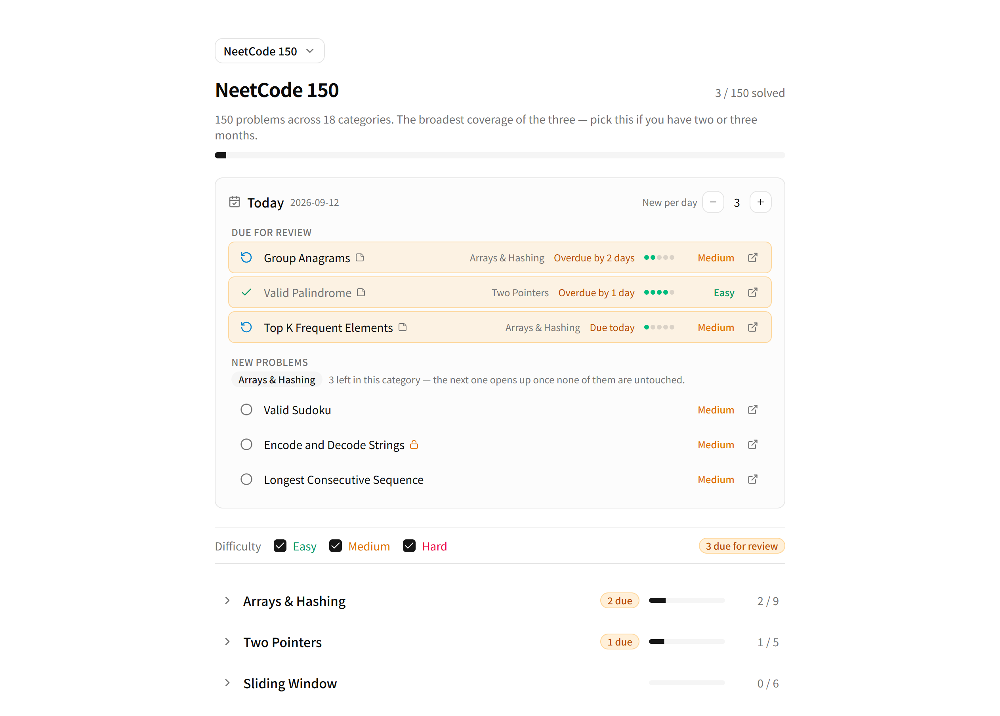
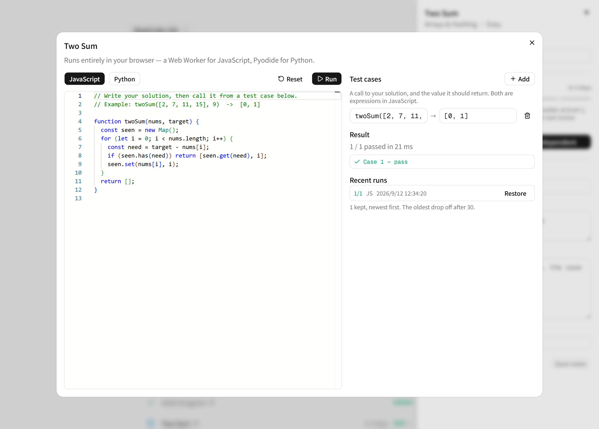

# LeetcodeHelper

Spaced-repetition tracking for NeetCode 150, Blind 75 and Grind 75 — review
what you have already solved, pick up something new, every day.

Working through a 150-problem list is easy to start and hard to sustain. Two
weeks in, the hard part is no longer finding a problem to solve; it is
remembering which ones you only *thought* you understood. LeetcodeHelper keeps
that bookkeeping for you: every problem you solve comes back on a widening
schedule until it sticks, and the day's queue is assembled for you instead of
being something you have to decide.



Write a solution and run it without leaving the page — JavaScript in a Web
Worker, Python through Pyodide, both in your own browser:



## Status

**Working.** Everything the roadmap below has ticked is built and in use: the
category list, the notes panel, the review schedule, the Today panel, the
in-browser code runner, and switching between the three built-in lists or one
you assemble yourself. What is left is the optional Piston integration, which
would add compiled languages at the cost of requiring Docker.

## Quick Start

Node 22.14 or newer. The floor is measured rather than guessed: better-sqlite3
ships a prebuilt native binding, and on Linux that binding segfaults the moment
a database is opened on Node 22.12 and 22.13. It works from 22.14 onward, and
on 24.

```bash
npm install
npm run dev
```

Then open http://localhost:3000.

No API keys, no environment variables, no account. Progress is stored in a
local SQLite file under `data/`, which is git-ignored.

There is no hosted demo, and that is a design consequence rather than an
omission: progress lives in a SQLite file on the server's disk, and the
serverless platforms this would otherwise deploy to have an ephemeral
filesystem — every request could land on a different, empty database. Running
it locally is the intended way to use it.

The code editor and the Python runtime are fetched from a public CDN the first
time you open the runner, so that part needs a network connection. Nothing of
yours is sent anywhere — see [Data & Privacy](#data--privacy).

## Commands

| Command | What it does |
| --- | --- |
| `npm run dev` | Start the dev server on port 3000 |
| `npm run build` | Production build, including a TypeScript pass |
| `npm run lint` | ESLint over the whole project |
| `npm test` | Vitest — catalogs, scheduling, storage, migrations and the API |

## Problem Lists

| List | Problems | Categories | Source |
| --- | --- | --- | --- |
| NeetCode 150 | 150 | 18 | [neetcode.io/practice](https://neetcode.io/practice) |
| Blind 75 | 75 | 13 | [neetcode.io](https://neetcode.io/practice/practice/blind75) |
| Grind 75 | 75 | 15 | [techinterviewhandbook.org](https://www.techinterviewhandbook.org/grind75/) |

De-duplicated across all three, that is **168 distinct problems**. Seven of them
are locked behind LeetCode Premium and carry a link to a free LintCode mirror.

`npm test` checks every one of those numbers on each run, so the catalogs cannot
drift from what this README claims. It is also how a real defect was found:
LeetCode 235 was recorded as Medium in one list and Easy in the other two.

### Progress follows the problem, not the list

Progress is keyed by the LeetCode slug and is never scoped to a list. Mark Two
Sum as mastered while working through Blind 75, switch to NeetCode 150, and it
is still mastered there — the same problem is the same problem. This is what
makes it reasonable to start on Blind 75 for coverage and later switch to
NeetCode 150 for depth without re-grinding the overlap.

The same holds for lists you build yourself. A custom list stores references to
problems, never copies of them, so deleting the list throws away the view and
not the work behind it.

## Mastery Levels & Spaced Repetition

Each problem carries a mastery level from 0 to 5, and the next review is
scheduled at widening intervals — 1, 3, 7 and 21 days — so problems you keep
getting right stop competing for your attention and problems you keep missing
do not. At level 5 a problem retires and is not scheduled again.

Two rules are worth stating, because neither is obvious:

- **A hint resets you to level 1**, from wherever you were. Solving it with
  help is evidence you did not know it, not evidence of slower progress, so
  the schedule starts over.
- **An unaided solve never lands on level 1**, because level 1 *means* "needed
  a hint". Solving one cold from scratch starts at level 2.

## Roadmap

- [x] Problem catalogs for the three built-in lists, with validation tests
- [x] SQLite persistence layer and the progress API
- [x] Collapsible category list with per-category completion bars
- [x] Notes panel and the review actions that drive the schedule
- [x] "Today" panel — problems due for review plus a configurable number of new ones
- [x] In-browser code runner (JavaScript via Web Worker, Python via Pyodide)
- [x] Custom lists assembled from the merged 168-problem pool
- [ ] Optional Piston integration for compiled languages

## Project Structure

```
app/              Next.js App Router pages and API routes
components/       UI components, including shadcn/ui primitives
hooks/            Data fetching and stored browsing preferences
lib/lists/        The three problem catalogs and the list registry
lib/code-runner/  The worker, and the pure parts it shares with the UI
tests/            Vitest suites
data/             Local SQLite database (git-ignored)
```

## Tech Stack

Next.js 16 (App Router), React 19, TypeScript, Tailwind CSS 4, shadcn/ui on the
Radix base, and Vitest. Persistence is better-sqlite3 — a local file, not a
server.

## Data & Privacy

Your data stays on your machine. Progress and notes live in a SQLite file
inside the project directory, and draft code and run history live in the
browser's localStorage. Nothing you write is uploaded, and there is no account
to create. Deleting `data/` and clearing the site's storage deletes all of it.

Your code is not uploaded either: it runs in a Web Worker in your own browser,
and Python runs there too through Pyodide compiled to WebAssembly. Two assets
*are* downloaded from jsDelivr on first use — the Monaco editor and the Pyodide
runtime. That is a request for a static file, with none of your content
attached, and both are cached by the browser afterwards.

## License

MIT. See [LICENSE](./LICENSE).
